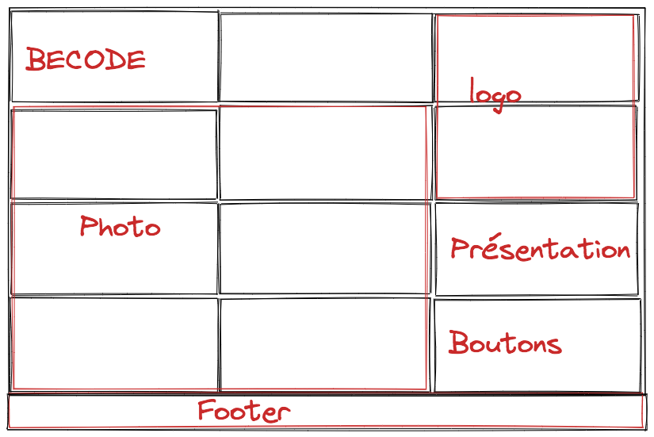

# <u>v-card</u>

## <u>Croquis</u>

The following is the sketch which served as a model to develop my "v-card"

## <u>V-card final</u>

  
This is the end result of the exo "v-card" whose goal was to develop a business card. 
The purpose of this exercise was to put into practice flex and / or grid that we had to learn about. 